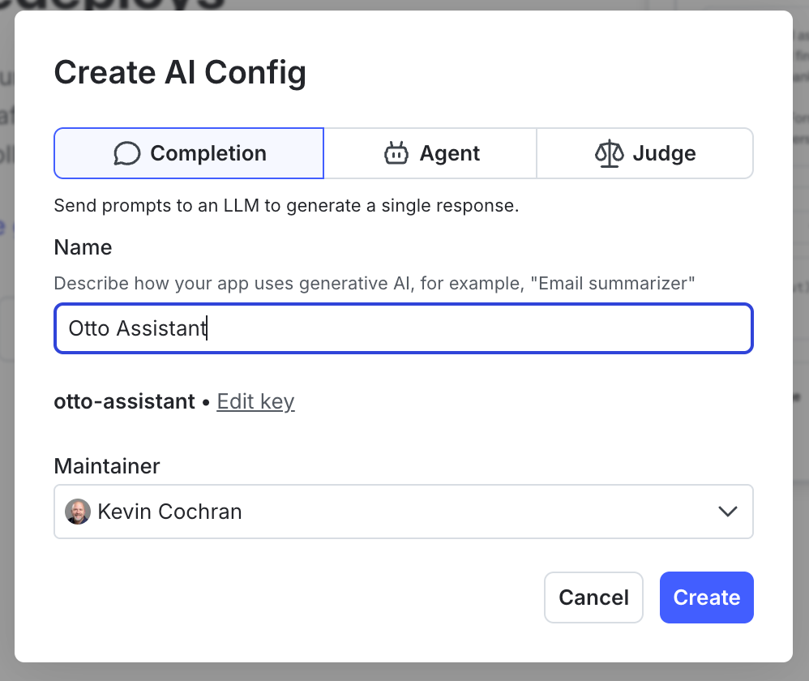

# Meet Otto

ToggleWear wants an AI shopping assistant on the storefront, and we're going to build it. We've named him Otto. Right now he's a placeholder — the chat widget on the [ToggleWear](#tab-1) tab returns a canned "not wired up yet" line. We're going to fix that.

By the end of this challenge:

- Otto exists as an **AI Config** in LaunchDarkly.
- He has a starting prompt and a starting model (Claude Haiku 4.5 on Bedrock).
- The ToggleWear app evaluates the AI Config on each `/chat` call.
- Otto says his first real words.

# Create Otto's AI Config

Open the [LaunchDarkly](#tab-0) tab.

1. From the left-hand navigation, click **AI Configs**.
2. Click **Create AI Config** in the upper right. <!-- VERIFY: exact button label -->
3. For **Name**, enter:
```text
Otto Assistant
```
4. For **Key**, the UI should pre-fill `otto-assistant`. Confirm or set it to:
```text
otto-assistant
```
5. For **Mode**, select **Completion**. <!-- VERIFY: mode picker location -->
6. Click **Create**.

 <!-- screenshot to be captured by operator -->

# Add Otto's first variation

The AI Config exists but has no variations yet — nothing to serve. Add the "born" variation.

1. On the AI Config detail page, click **Add variation**.
2. For **Name**, enter:
```text
Otto v1 (Born)
```
3. For **Key**, confirm or enter:
```text
otto-born
```
4. Under **Model**, pick **Anthropic Claude Haiku 4.5** from the list. <!-- VERIFY: model picker UX -->
5. Under **Messages**, add a **system** message with this content:
```text
You are a customer service assistant for ToggleWear, an online retailer. Answer questions from customers about products and store policies. Be accurate and concise.
```
6. Click **Save**.

# Turn Otto on in `test`

By default Otto's `test` environment is serving the placeholder "disabled" variation. Switch it to the Born variation we just created.

1. Click the **Targeting** tab.
2. Make sure the environment selector reads **test**.
3. Under **Default rule** (also called "fallthrough"), pick **Otto v1 (Born)**. <!-- VERIFY: UX path for setting the default variation -->
4. Click **Review and save**, then confirm. <!-- VERIFY: save button labels -->

# Wire Otto into the app

Open the [Code Editor](#tab-2) tab. Open `app/server.py`.

Find the block marked:

```python
# ─────────────────────────────────────────────────────────────────────
# Challenge 01 paste block — replace this stub with real Otto code.
```

Replace **everything between the opening marker and the** `# ─── End Challenge 01 paste block ────` **line** with:

```python
    # Build context, evaluate the otto-assistant AI Config.
    context = Context.builder(req.session_id).set("tier", req.user_tier).build()
    cfg = ai_client.completion_config(OTTO_CONFIG_KEY, context, FALLBACK_CONFIG)

    if not cfg.enabled or cfg.model is None:
        return JSONResponse(status_code=503, content={
            "response": "Otto isn't enabled. Check the AI Config targeting.",
            "turn": turn, "turn_limit": TURN_LIMIT,
        })

    # Translate the AI Config's messages into Bedrock Converse format.
    system_blocks = []
    seed_messages = []
    for m in cfg.messages or []:
        if m.role == "system":
            system_blocks.append({"text": m.content})
        else:
            seed_messages.append({"role": m.role, "content": [{"text": m.content}]})

    # Merge in this session's prior turns + the new user message.
    with _state_lock:
        prior = list(_history[req.session_id])
    history_blocks = [{"role": m.role, "content": [{"text": m.content}]} for m in prior]
    bedrock_messages = seed_messages + history_blocks + [
        {"role": "user", "content": [{"text": req.message}]}
    ]

    model_id = resolve_bedrock_model(cfg.model.name)
    tracker = cfg.create_tracker()

    try:
        response = tracker.track_bedrock_converse_metrics(
            bedrock.converse(modelId=model_id, messages=bedrock_messages, system=system_blocks)
        )
    except ClientError as e:
        code = e.response.get("Error", {}).get("Code")
        log.error("Bedrock ClientError: %s", code)
        return JSONResponse(status_code=502, content={
            "response": _bedrock_user_message(code),
            "turn": turn, "turn_limit": TURN_LIMIT,
        })

    assistant_text = _extract_text(response)
    with _state_lock:
        _history[req.session_id].append(LDMessage(role="user", content=req.message))
        _history[req.session_id].append(LDMessage(role="assistant", content=assistant_text))

    usage = response.get("usage") or {}
    metrics = response.get("metrics") or {}
    log.info(
        "chat session=%s tier=%s turn=%d model=%s tokens_in=%s tokens_out=%s latency_ms=%s",
        req.session_id, req.user_tier, turn, model_id,
        usage.get("inputTokens"), usage.get("outputTokens"), metrics.get("latencyMs"),
    )
```

Save the file. The ToggleWear service auto-reloads.

# Say hi to Otto

Open the [ToggleWear](#tab-1) tab. Click **Chat with Otto** in the bottom-right. Ask him something — try:

```text
Got any t-shirts?
```

Otto should answer for real this time. He'll be brief and a little robotic — that's by design. We'll give him a personality in the next challenge.

When you're satisfied, click **Check** below.
